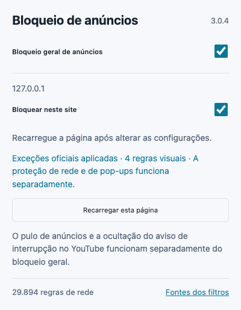

# AdBlock + YouTube

**Bloqueio de anúncios para Chrome, com tratamento dedicado ao YouTube.**

Extensão de código aberto em Manifest V3. Bloqueia solicitações de anúncios, oculta áreas publicitárias e trata anúncios do player do YouTube com prevenção e pulo automático. O popup mostra o estado dos filtros e permite liberar um site.

[English](docs/README.en.md) · [Bahasa Indonesia](docs/README.id.md) · [한국어](docs/README.ko.md)

[Baixar Chrome 3.0.4](https://github.com/stpcoder/youtube-auto-skip/releases/tag/v3.0.4-preview.1) · [Instalação e atualização](docs/INSTALL.md) · [Relatar um problema](https://github.com/stpcoder/youtube-auto-skip/issues/new/choose)



## Instalar no Chrome

1. Baixe `youtube-auto-skip-chrome-3.0.4.zip` na [versão de teste](https://github.com/stpcoder/youtube-auto-skip/releases/tag/v3.0.4-preview.1).
2. Extraia a pasta `youtube-auto-skip` e abra `chrome://extensions`.
3. Ative **Modo do desenvolvedor**, escolha **Carregar sem compactação** e selecione a pasta que contém `manifest.json`.
4. Confira **3.0.4** e recarregue as páginas abertas. Abra o popup para verificar o diagnóstico ou liberar o site atual.

Requer **Chrome 111+ no computador**. O ZIP já contém filtros e bundles: não exige Node.js ou compilação para instalar. Também é possível usar **Code → Download ZIP** ou clonar o repositório; escolha a pasta raiz que contém `manifest.json`. Veja [instalação, atualização e solução de problemas](docs/INSTALL.md).

A extensão ainda não está na Chrome Web Store. O controle geral não desativa a proteção dedicada ao YouTube. Para parar todas as funções, desative a extensão em `chrome://extensions`.

## O que está incluído

- Filtros de rede e visuais de EasyList e YousList, com exceções oficiais de ocultação genérica e específica.
- Proteção contra pop-ups de servidores de anúncios conhecidos e exceções por site.
- Tratamento de campos de anúncios em respostas conhecidas do player do YouTube, com tentativas de pulo e clique como alternativas.
- Recuperação inicial limitada de buffer vazio e ocultação do aviso específico de interrupção em coreano.
- Popup em português, inglês, indonésio e coreano, com diagnóstico, versão real e botão para recarregar a página.

**Esta é uma versão de teste.** Não garante bloquear todos os anúncios nem iniciar todos os vídeos imediatamente. Não implementa o motor completo do uBlock Origin ou do AdGuard. Alterações no YouTube e regras não suportadas podem afetar o resultado.

Os filtros incluem **29.894 regras de rede**, **30.236 entradas visuais** e **169 exceções de política visual**. Esses números não representam taxa de sucesso. YousList complementa sites coreanos; EasyList Portuguese e ABPindo ainda não estão incluídos. A cobertura de sites brasileiros e indonésios ainda requer validação local. [Fontes e limites da conversão](filters/provenance.json).

## Safari / iPhone

O repositório inclui uma extensão YouTube para Safari **1.0.0 em desenvolvimento**, com tentativas de PiP e áudio direto quando disponível. O ZIP Safari contém fontes, não um aplicativo iOS assinado. A instalação exige Mac, Xcode e assinatura própria. PiP e reprodução com a tela bloqueada ainda não foram validados em iPhone real. [Preparar o projeto](docs/SAFARI.en.md) · [Guia em coreano](safari/README.md).

## Permissões e dados

O acesso HTTP/HTTPS aplica filtros em sites. `storage` guarda preferências localmente; `scripting` aplica CSS; `declarativeNetRequest` filtra solicitações; `webNavigation` acompanha novas janelas de anúncios. `debugger` é usado como alternativa de clique no botão de pular do YouTube e pode exibir um aviso do Chrome.

Esta versão não envia telemetria ao mantenedor. Os filtros vêm no pacote e são atualizados com uma nova versão da extensão. Apenas o comando de desenvolvimento para reconstruir filtros baixa as fontes originais. [Licenças e atribuição](THIRD_PARTY_NOTICES.md).

## Desenvolvimento

```sh
git clone https://github.com/stpcoder/youtube-auto-skip.git
cd youtube-auto-skip
npm ci
npm run verify
npm run build:release
```

Use **Node.js 22+**. O build dos ZIPs usa Node.js e funciona sem um comando externo `zip` ou Xcode. Para mudar o código geral, execute `npm run build:general`. `npm run build:filters -- --offline` reconstrói as fontes salvas; o build online atualiza filtros e pode alterar a cobertura.

`npm run preview` abre uma prévia local do popup. [Testes](tests/README.md) · [Arquitetura](docs/TECHNICAL.md) · [Validação desta versão](docs/VALIDATION.md) · [Contribuir](CONTRIBUTING.md).

Código GPL-3.0-only; filtros com licenças separadas. Projeto independente de YouTube e Google.
